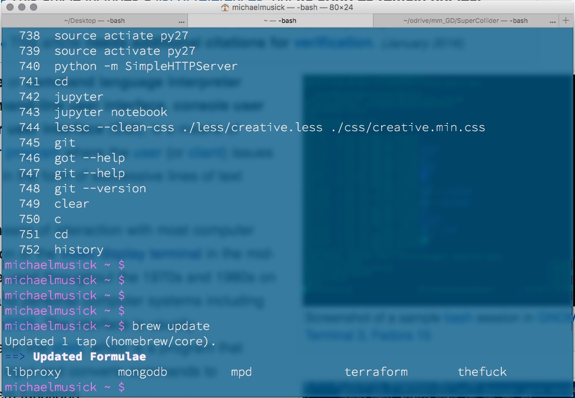
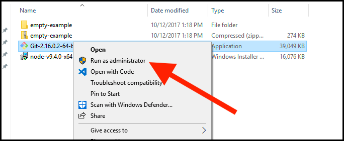
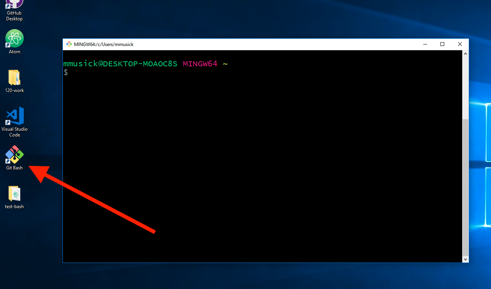

# Your Development Environment

As a creative technologist and developer you will need to take control of your computer. You should start to consider your computer as an instrument or creative tool that serves as an extension of yourself.

This means you need to be comfortable with your computer and *know* your computer.

## Command-line interface (CLI)

One of the most basic ways of working with your computer is through a [command-line interface (CLI)](https://en.wikipedia.org/wiki/Command-line_interface).

Although such programs can appear intimidating to a beginner user, these command line programs remove are simple applications that allow for detailed control of the OS. These programs allow a user to accomplish many of that same tasks that they are used to completing with a mouse, through text only commands. One reason to use such a program is that it can speed up the development process and also display more information than is typical of a traditional “graphical user interface” (GUI; pronounced ‘gooey’) based environment.

## Directory

One advantage of a CLI over a GUI-based file browser is quicker manipulation of files and directories. The manipulation of files and directories will be a very common activity for you in this course. As such, please take a moment to read the following [Wikipedia page describing ‘directories’](https://en.wikipedia.org/wiki/Directory_(computing)) and make sure you understand what a directory is, as well as its related terminology.

> Note: "Directories" and "Folders" are the same thing. These will be interchangable throughout this course.

<iframe class="embed-responsive-item" src="https://www.youtube.com/embed/CuyD_n3XzbE" frameborder="0" allowfullscreen></iframe>

## Learning your CLI

### - Unix
Unix operating systems refer to both macOS (formerly OS X) and Linux. These OS’s will use similar commands within their CLI’s. On macOS, the default CLI is `terminal.app`. However, there are many CLI’s that can be downloaded and used in unix-based operating systems.

For those of you who are unfamiliar with using the terminal in unix operating systems, you should work through following book.

**[Unix for the Beginning Mage](http://unixmages.com/ufbm.pdf)**

This resource walks you through the basics of using terminal via a ‘cutesy’ story. (Sorry if this is not your thing. Unfortunately, it is a very good resource.)

NOTE: If you do not have Xcode.app installed on your Mac, you should do so. We will not be using Xcode, however, it installs additional command line tools which we will use. Xcode can be installed via the Mac App Store. After installing Xcode, open it once, then close it and forget about it for the time being.

### - Windows
Windows users have a couple of options when it comes to a CLI. Traditionally, Windows has utilized a program known as Command Prompt for decades. This program is a relative of MS-DOS, an early operating system and precursor to Windows. In recent years there has been a move within the development community towards Window's newer PowerShell CLI. However, there is also a move towards a Bash-like or true Bash (the Linux and macOS CLI) program for windows.

I am going to suggest you utilize the last of these options. Unfortunately, a Bash shell does not exist by default on Windows yet. You have two options to get one.

1. Windows now includes a "Linux Environment" that can be turned on.
    - To install the Window's approved "Windows Subsystem for Linux", please follow the instructions from the following site;
        - [https://docs.microsoft.com/en-us/windows/wsl/install-win10](https://docs.microsoft.com/en-us/windows/wsl/install-win10)

2. A simpler solution (and the recommended one for this course), is to install a Bash-like CLI.
    - The disadvantage of this solution is that it is not as integrated as the "Windows Subsystem for Linux". However, for the CLI work you will do in this course, it works just fine.

To get a Bash environment, windows users should install Git. Git can be downloaded from the following link;

- [https://git-scm.com/download/win](https://git-scm.com/download/win)

After downloading the program, right-click the install executable, and select "Run as Administrator". (**THIS IS IMPORTANT** You must run as administrator to give Git Bash necessary permissions.)

This will install a program known as "Git", along with one called "Git Bash". You can now open "Git Bash".

After installing either "Windows Subsystem for Linux" or "Git Bash", you should work through the following PDF book.

**[Unix for the Beginning Mage](http://unixmages.com/ufbm.pdf)**

This resource walks you through the basics of using terminal via a ‘cutesy’ story. (Sorry if this is not your thing. Unfortunately, it is a very good resource.)

<!-- You can launch PowerShell console by pressing Windows key, typing PowerShell, and clicking on Windows PowerShell.

If you are unfamiliar with using PowerShell on Windows, please work through the following resource.

**[PowerShell Beginner’s Guide](https://github.com/PowerShell/PowerShell/blob/master/docs/learning-powershell/powershell-beginners-guide.md)**

and watch the following video:

<iframe class="embed-responsive-item" src="https://channel9.msdn.com/Series/GetStartedPowerShell3/01/player" allowFullScreen frameBorder="0"></iframe>
  -->

## { TODO: }

Before moving on this week, you should ensure you are comfortable with the following;

- Be capable of performing the following actions via command line.
	- Navigate between and around directories.
	- List the contents of directories. (Including ‘hidden’ files’)
	- Be able to change a files name.
	- Be able to create an empty file.
	- Be able to create a new directory.
	- Be able to move a file/directory.
	- Be able to delete a file.
	- Be able to delete a directory.
	- Understand what a ‘super user’ is. (Unix only)
	- Understand what file permissions are, how to view them, and how to change them. (Unix only)
